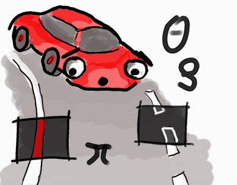

#Self Driving Car Engineer Project 1 - Finding Lane Lines on the Road
##Benjamin Söllner, 27 Mar 2017

---

---

The goals / steps of this project are the following:
* Make a pipeline that finds lane lines on the road: realized with a [python notebook](P1.ipynb).
* Reflect on your work in a written report: provided in this document.
* The project is based on Udacity's  [specifications](https://review.udacity.com/#!/rubrics/322/view) and [starter kit](https://github.com/udacity/CarND-Term1-Starter-Kit/blob/master/README.md)

---
